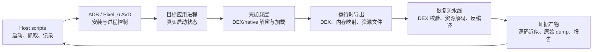

# Design: android-apk-runtime-unpack

## Architecture

主循环是“脚本启动样本 → 目标进程加载壳 → 导出运行时数据 → 恢复和校验 → 记录结果”。外部网络只作为应用自身运行边界观察，不作为源码恢复的输入；第一轮默认不依赖真实业务账号或服务端响应。

## Interfaces

- 运行时任务入口 `python scripts\runtime_unpack.py --apk <path> --package <name> --avd <id> --output <dir>`
  - Input: APK 绝对路径；包名；已存在的 AVD ID；输出目录；可选启动 Activity。
  - Output: 退出码、任务清单 `manifest.json`、ADB 命令日志、安装/启动日志、进程状态和导出文件索引。
  - Error codes: `2` 参数或文件不存在；`3` ADB/AVD 不可用；`4` 安装失败；`5` 启动失败；`6` 运行时导出为空；`7` 产物校验失败。
  - Invariants: 原始 APK 不被修改；每次任务使用独立输出目录；失败必须保留 stderr 和设备状态。
- 运行时导出结果 `artifacts/<task-id>/manifest.json`
  - Input: 当前样本 SHA-256、包名、设备序列号、系统版本、开始/结束时间、执行步骤结果。
  - Output: `dex_files[]`、`native_maps[]`、`pulled_files[]`、`logcat` 路径、`checks[]`。
  - Error codes: `sample_hash_mismatch`、`package_mismatch`、`device_missing`、`abi_mismatch`、`no_dex_found`。
  - Invariants: 每个导出文件包含大小和 SHA-256；任何恢复文件都能追溯到样本和导出步骤。
- 源码恢复入口 `python scripts\recover_sources.py --input <artifact-dir> --output <source-dir>`
  - Input: 运行时导出的 DEX/资源/native 文件索引；工具版本；输出目录。
  - Output: JADX/apktool 结果、工具版本、命令日志、失败文件清单和可反编译文件索引。
  - Error codes: `2` 输入索引缺失；`4` DEX 无效；`5` 资源解码失败；`6` 工具未安装；`7` 输出校验失败。
  - Invariants: 反编译文本标记为近似源码；原始 DEX 和反编译结果分目录保存。

## Data Model

- `TaskManifest`
  - `task_id`: 唯一任务名。
  - `sample_path`: 原始 APK 绝对路径。
  - `sample_sha256`: 任务开始前计算的 SHA-256。
  - `package_name`: 期望包名。
  - `avd_id`, `device_serial`, `android_release`, `abi`: 运行环境信息。
  - `steps[]`: 步骤名、开始时间、结束时间、退出码、日志路径。
  - `artifacts[]`: 文件路径、类型、大小、SHA-256、来源步骤。
- `RecoveredDex`
  - `path`: 导出的 DEX 文件路径。
  - `origin`: `apk_entry`、`private_dir`、`proc_map` 或 `memory_dump`。
  - `dex_version`, `class_defs`, `method_ids`, `sha256`。
  - `source_status`: `not_started`、`decompiled`、`partial` 或 `invalid`。
- 关键不变量：原始样本哈希在任务期间保持不变；没有哈希和来源记录的 dump 不进入源码恢复流水线；ABI 不匹配时任务状态为 `blocked_abi`，不伪造成功。

## Key Decisions

- Problem: 壳数据可能只在目标进程启动后短暂存在，单纯解压 APK 得到的 DEX 只有壳入口，直接反编译会漏掉业务代码。
- Solution: 先记录进程启动和加载事件，再以运行时 DEX/映射文件为恢复入口，静态尾随数据分析作为运行时失败时的补充证据。
- Cost: 需要 AVD 或 ARM 设备，执行时间更长，且运行时产物依赖系统版本和 ABI。
- Why not the alternatives: 只做静态解压无法覆盖被动态释放的业务 DEX；只改 APK 跳过校验会改变真实加载路径。

- Problem: 现有 AVD 是 x86_64，而目标包的 native 库是 ARM；直接把“安装成功”当作“壳已运行”会把 ABI 失败误判为样本问题。
- Solution: 把设备 ABI 和 native 加载结果写入任务清单，明确区分 `abi_mismatch`、安装失败和启动失败，再决定是否切换 ARM 环境。
- Cost: 第一轮可能只能得到阻塞报告，需要额外 ARM 设备或兼容运行环境。
- Why not the alternatives: 忽略 ABI 会产生空 dump；预先修改 APK 去掉 native 依赖会破坏壳的真实行为。

## Migration / Compatibility

- 现有静态报告和脚本保留不变；运行时任务新增独立的 `artifacts/`、`logs/` 和 `reports/` 子目录。
- 输出格式使用 JSON 清单，后续工具只读取清单声明的文件，不依赖固定偏移或固定文件名。
- 如果没有可用 ARM 环境，静态分析结果仍可作为独立交付物，运行时任务状态明确标为阻塞，不覆盖已有报告。
